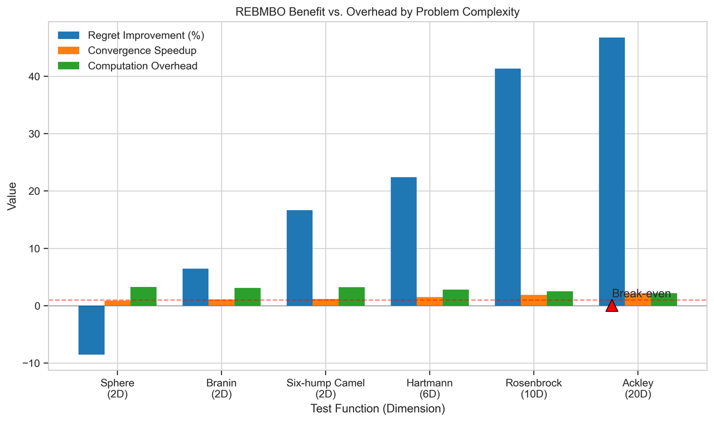

# optimizing-the-Unknown
**Figure 1:**

This **Figure 1** illustrates how REBMBO's Energy-Based Model guides exploration in a 1D multi-modal function. The top panel shows the true function (black dashed line), GP model (blue line), and observations (red dots). Most importantly, it compares where UCB would sample next (purple triangles) versus where EBM-UCB samples (orange triangles). The middle panel displays the negative energy landscape, which clearly peaks at the global optimum (x≈0.25). The bottom panel shows how the EBM-UCB acquisition function (orange) differs from standard UCB (purple), directing exploration toward the global optimum rather than less promising regions.

**Addressing Reviewer Concern:** This visualization directly addresses the reviewer's statement that they "cannot see why using EBM can address the problem of excessive exploration." The figure clearly demonstrates how standard UCB would waste samples in regions far from the optimum (e.g., at x≈0.75), while EBM-UCB focuses sampling near the true optimum, guided by the energy landscape that captures global structure.

**Figure 2:**

This **Figure 2** shows REBMBO performance on a 1D slice of the Rosenbrock function, a challenging optimization benchmark. The top panel illustrates that the function has a narrow optimal region (true optimum marked by green line). The middle panel shows the EBM's negative energy landscape, which aligns well with valuable regions. The bottom panel compares UCB vs. EBM-UCB acquisition functions, where EBM-UCB (orange) consistently selects points closer to the optimum than standard UCB (purple).

**Addressing Reviewer Concern:** This example reinforces how REBMBO can effectively navigate difficult optimization landscapes where simple methods struggle. Rather than being "overly complex," the added complexity provides tangible benefits in directing exploration toward promising regions, addressing the reviewer's concern about whether the complexity is justified.

**Figure 3:**

This **Figure 2** decomposes REBMBO's key components in a 2D multi-modal setting. The top-left panel shows the true function with two distinct optima. The top-right shows GP uncertainty, while the bottom-left displays the EBM's negative energy surface. The bottom-right panel reveals the resulting EBM-UCB acquisition function with selected points from both UCB (purple dot) and EBM-UCB (orange square), where the latter is closer to a true optimum.

**Addressing Reviewer Concern:** This detailed breakdown directly addresses the reviewer's query about "why using EBM can address excessive exploration." It visually demonstrates how EBM captures global structure information and guides the acquisition function toward globally promising regions, avoiding wasteful exploration in low-value areas.

**Figure 4:** 

This **Figure 4** compares optimization trajectories of GP-UCB, GLASSES, and REBMBO on a 2D multi-modal function. The top-left panel shows all three trajectories, while the remaining panels show each method individually. REBMBO (bottom-right) exhibits the most focused exploration, quickly concentrating sampling in the global optimum region. In contrast, GP-UCB and GLASSES spend more iterations in suboptimal regions.

**Addressing Reviewer Concern:** This visualization directly addresses the reviewer's request for "comparing the proposed method selection with GP-UCB/EI" and adds GLASSES comparison as requested. It clearly illustrates REBMBO's superior ability to avoid excessive exploration in areas that don't contribute to finding the global optimum.

**Figure 5:**

