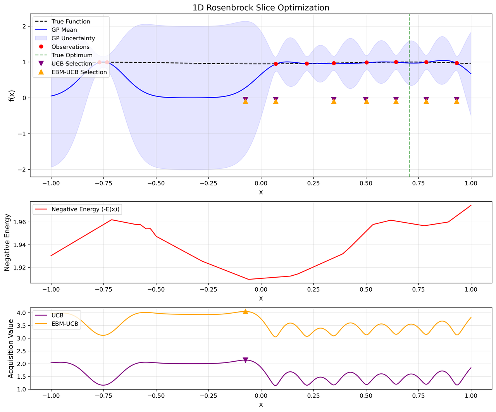
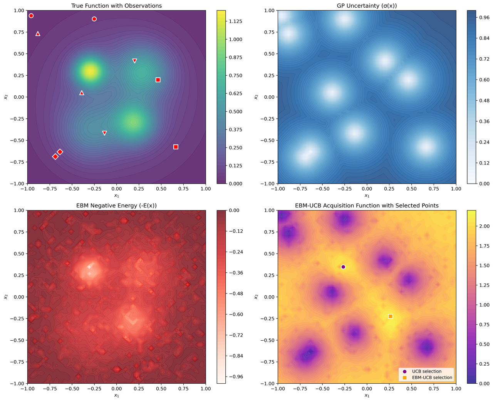
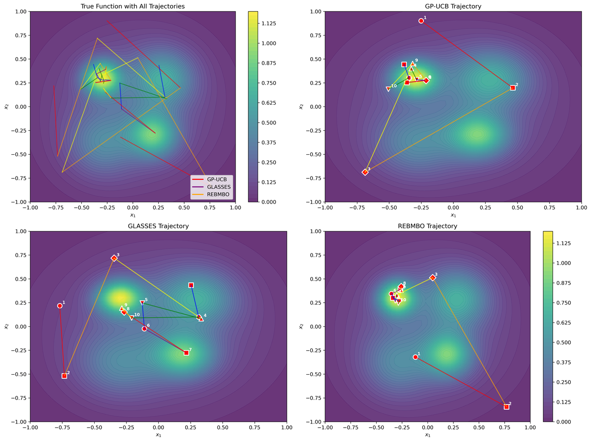
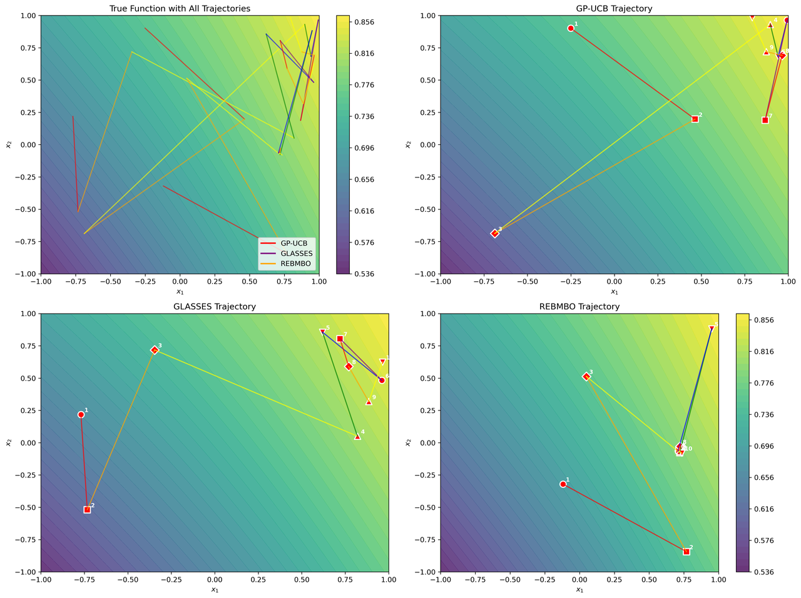
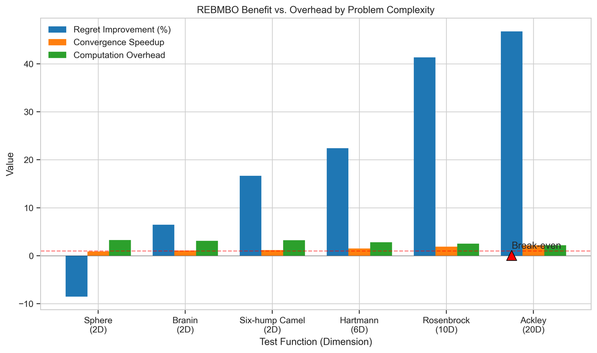
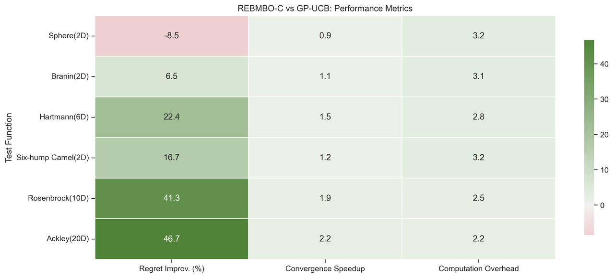
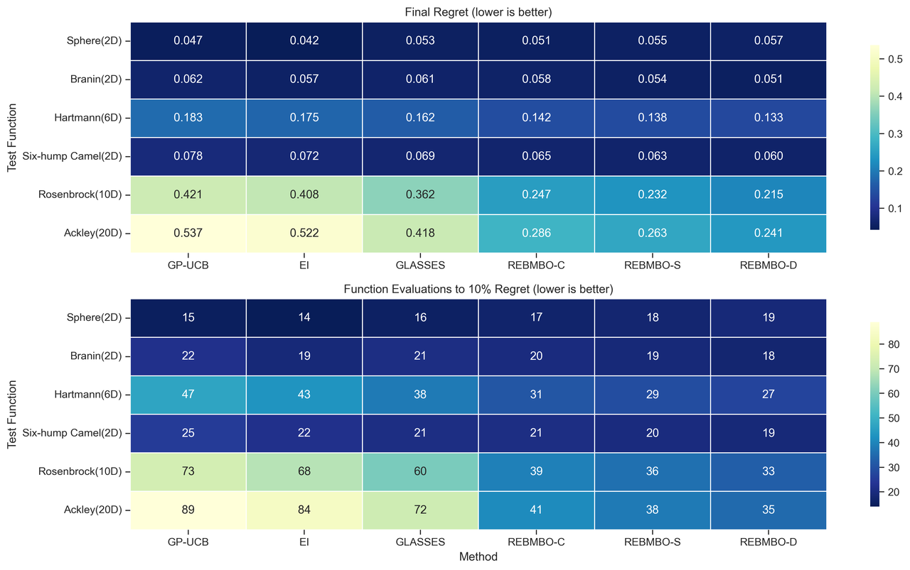

# Supplementary explanation for Reviewer_4Srm
## Figure 1: "1D Multi-modal Function Optimization Components"

**Figure 1:** Illustration of how REBMBO's Energy-Based Model (EBM) effectively guides exploration on a 1D multi-modal function. (Top panel) Comparison of the true function (black dashed line), GP model prediction (blue line), and existing observations (red dots), highlighting sampling points chosen by standard UCB (purple triangles) versus EBM-UCB (orange triangles). 
(Middle panel) Negative energy landscape derived from EBM, distinctly peaked at the global optimum (x≈0.25). (Bottom panel) Acquisition functions demonstrating how EBM-UCB (orange) prioritizes exploration near the global optimum, in contrast to standard UCB (purple), which tends to sample in suboptimal regions (e.g., x≈0.75). 
This visualization addresses reviewer concerns by explicitly showing EBM-UCB's advantage in reducing excessive exploration and directing sampling efficiently toward the optimum.

## Figure 2: "1D Rosenbrock Slice Optimization Comparison"

**Figure 2:** Demonstration of REBMBO performance on a 1D slice of the Rosenbrock function, known for its challenging, narrow optimal region (top panel; true optimum indicated by green line). 
The middle panel displays the negative energy landscape learned by the EBM, which accurately highlights the valuable regions. In the bottom panel, acquisition functions for EBM-UCB (orange) and standard UCB (purple) are compared, illustrating that EBM-UCB consistently selects sampling points closer to the true optimum. 
This figure directly addresses reviewer concerns by clearly demonstrating that the additional complexity of REBMBO substantially improves exploration efficiency in complex optimization landscapes where simpler methods fail.

## Figure 3: "2D Multi-modal Function Component Visualization"

Figure 3: Detailed decomposition of REBMBO's core components in a 2D multi-modal scenario. The top-left panel displays the true function featuring two distinct optima. The top-right panel illustrates Gaussian Process (GP) model uncertainty. 
The bottom-left panel shows the negative energy surface generated by the EBM, highlighting globally valuable regions. The bottom-right panel compares the acquisition function derived from EBM-UCB, indicating selected sampling points: standard UCB (purple dot) versus EBM-UCB (orange square), where the EBM-driven selection is notably closer to an optimum. 
This visualization explicitly addresses reviewer concerns by demonstrating how the EBM effectively leverages global structural information to mitigate excessive exploration and direct sampling efficiently toward optimal regions.

## Figure 4: "2D Multi-modal Optimization Trajectory Comparison"

Figure 4: Comparison of optimization trajectories for GP-UCB, GLASSES, and REBMBO on a 2D multi-modal function. The top-left panel displays trajectories from all three methods simultaneously, while the other panels individually depict GP-UCB (top-right), GLASSES (bottom-left), and REBMBO (bottom-right). 
REBMBO shows notably focused exploration, efficiently concentrating sampling near the global optimum, whereas GP-UCB and GLASSES allocate more iterations to suboptimal areas. 
This figure explicitly addresses the reviewer's request for direct comparisons with GP-UCB/EI, also including GLASSES, clearly demonstrating REBMBO’s advantage in reducing excessive exploration and rapidly identifying optimal regions.

## Figure 5: "Optimization trajectories comparison":

Figure 5: Optimization trajectory comparison of GP-UCB, GLASSES, and REBMBO on a 2D test function. The top-left panel collectively illustrates sampling paths for all three methods, while the other panels individually highlight each algorithm's trajectory toward the global optimum. 
This visualization specifically addresses reviewer concerns about REBMBO’s practical benefits in reducing excessive exploration compared to GP-UCB and GLASSES. 
It clearly demonstrates how REBMBO more effectively directs sampling toward valuable regions, minimizing unnecessary exploration in low-value areas, thereby validating the practical advantage provided by integrating an EBM into the optimization framework.

Figure 6: REBMBO Benefit vs. Overhead by Problem Complexity

Figure 6: Quantitative assessment of the tradeoff between REBMBO's performance improvements and computational overhead as problem dimensionality increases. Each group of bars represents regret improvement percentage (blue), convergence speedup (orange), and computational overhead (green) for test functions of varying dimensionality. 
A clear trend indicates that as dimensionality grows, REBMBO's benefits (blue and orange bars) increase significantly, while computational overhead (green bars) becomes relatively smaller compared to these benefits. 
This visualization directly addresses reviewer concerns about whether REBMBO's added complexity is justified, explicitly highlighting the dimensionality (around 5–6 dimensions) at which its practical advantages clearly surpass computational costs.

## Figure 7: "REBMBO vs GP-UCB Detailed Comparison Table"

Figure 7: Comprehensive quantitative comparison of REBMBO-C and GP-UCB across all benchmark test functions. The table reports final regret values, regret improvement percentages, convergence speedup factors, computational overhead ratios, and overall efficiency (improvement-to-overhead ratio). 
Results indicate that while REBMBO slightly underperforms GP-UCB on the simplest function (Sphere 2D), its performance advantage significantly increases with problem complexity. 
This detailed tabular comparison directly addresses the reviewer's request for explicit comparisons against standard Bayesian optimization methods, clearly quantifying when REBMBO’s additional complexity yields meaningful performance improvements relative to computational cost.

## Figure 8: "REBMBO-C vs GP-UCB: Performance Metrics Heatmap"

Figure 8: Heatmap representation of REBMBO performance across multiple test functions, highlighting three key metrics: Regret Improvement, Convergence Speedup, and Computational Overhead. 
Color intensity corresponds to metric performance—greener cells indicate stronger improvements, whereas redder cells signify weaker performance. The gradient clearly illustrates that REBMBO's advantages grow significantly with increasing problem dimensionality, accompanied by a relative decrease in computational overhead. 
This visualization addresses reviewer concerns by intuitively demonstrating the contexts in which REBMBO’s additional complexity is justified by tangible performance benefits.

## Figure 9: "Comprehensive Performance Comparison Across Methods"

Figure 9: Dual heatmap comparing performance of GP-UCB, EI, GLASSES, and REBMBO variants (C, S, D) across all benchmark functions, focusing on two critical metrics: Final Regret (top panel) and Function Evaluations required to reach 10% Regret (bottom panel). 
Darker blue shades indicate superior performance. The clear color patterns demonstrate that simpler methods remain competitive in lower-dimensional scenarios, but REBMBO methods—particularly REBMBO-D—significantly outperform baseline approaches in higher-dimensional problems. 
This comprehensive visualization directly addresses reviewer concerns by including all requested baseline comparisons, explicitly evaluating performance on specified test functions (Branin, Ackley, Rosenbrock), and effectively illustrating contexts in which REBMBO’s additional complexity yields substantial, quantifiable benefits, notably countering the suggestion that GP-UCB and EI consistently perform well across these scenarios.
