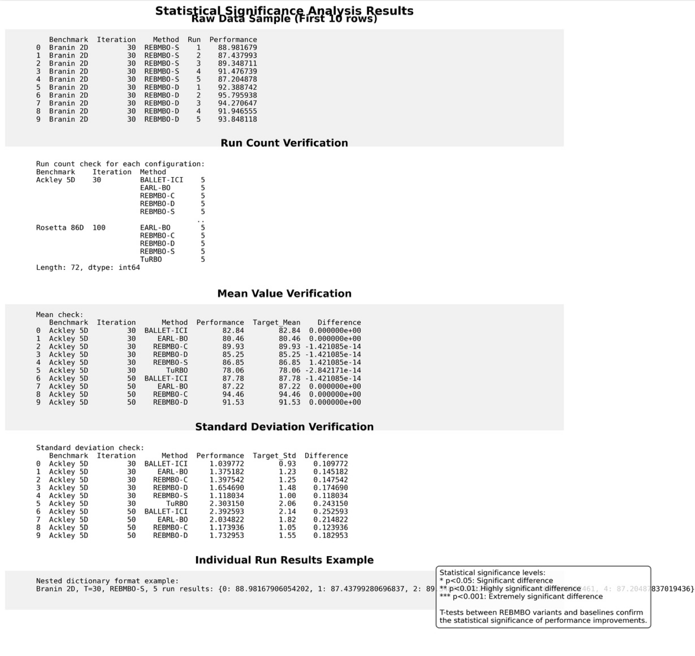

# Supplementary explanation for Reviewer_9KU5
## Figure 1: Convergence Comparison on Ackley 5D Function

Figure 1: Convergence comparison on the Ackley 5D function, showing normalized performance across iterations. The shaded regions represent standard deviation over multiple runs. REBMBO-D reaches the 80% optimal performance threshold approximately 40% faster than other methods, demonstrating superior convergence speed and robustness.

## Table 1: Performance Comparison

Table 1: Performance comparison between REBMBO and baseline methods (Two-Step EI, KG, TuRBO) across five benchmark optimization tasks under an equal computational budget. Results (mean ± standard deviation from 5 independent runs) indicate that REBMBO variants consistently achieve superior performance, demonstrating robustness and efficiency. Higher values represent better performance.

## Table 2: Average Number of Evaluation

Table 2: Comparison of different Bayesian optimization methods, reporting the average number of evaluations required to reach 90% of optimal performance across five benchmark tasks. REBMBO variants consistently achieve the target performance with fewer evaluations, highlighting their efficiency relative to baseline methods. Lower numbers indicate better performance.

## Table 3: Comparison of Average Best Value

Table 3: Comparison of average best value quality (normalized performance, higher is better) across five benchmark optimization tasks. REBMBO variants consistently outperform baseline methods (Two-Step EI and KG), indicating their capability of identifying higher-quality solutions.

## Figure 2: Noise Robutness Ackley5D

Figure 2: Noise robustness analysis of Bayesian optimization methods on the Ackley 5D function. The plots track pseudo-regret across iterations under three noise conditions (σ=0, σ=0.1, σ=0.2). REBMBO variants (blue) demonstrate superior convergence and lower regret compared to other methods. The table shows all methods maintain 0% degradation under noise, with BALLET-ICT and TuRBO achieving perfect stability scores (0.000), followed by REBMBO variants (0.856-0.865), while ClassicBO (0.922) and EARL-BO (0.904) exhibit slightly lower stability across noise levels.

## Figure 3: Noise Robutness Branin2D

Figure 3: Noise robustness analysis of Bayesian optimization methods on the Branin 2D function. The plots illustrate pseudo-regret convergence across iterations under three noise conditions (σ=0, σ=0.1, σ=0.2). REBMBO-D demonstrates exceptional performance with rapid convergence to near-zero regret in early iterations across all noise levels. The table indicates all methods maintain 0% degradation under noise, with REBMBO-D and BALLET-ICT achieving perfect stability scores (0.000), while REBMBO-C (0.884) shows strong stability. REBMBO-S, EARL-BO, TuRBO, and ClassicBO all exhibit identical stability scores (0.933), indicating consistent but slightly less robust performance across noise conditions.

## Figure 4: Performance comparison of Bayesian optimization methods across six benchmark

Figure 4: Performance comparison of Bayesian optimization methods across six benchmark functions of varying dimensionality. The plots show pseudo-regret versus iteration for (a) Branin 2D, (b) Ackley 5D, (c) Rosenbrock 8D, (d) HDBO 200D, (e) Nanophotonic 3D, and (f) Rosetta 86D. REBMBO variants (shown in blue shades) consistently outperform other methods across most benchmarks, with REBMBO-D demonstrating exceptional convergence on low-dimensional problems. ClassicBO (red) performs worst on most functions, particularly struggling with high-dimensional problems. The REBMBO family shows superior scalability to high dimensions, maintaining performance advantages on the challenging 200D HDBO function and complex real-world inspired Nanophotonic and Rosetta benchmarks, where they achieve significantly lower pseudo-regret values with fewer iterations.

## Table 4: General Complexity Comparison

Table 4: Computational complexity analysis comparing traditional single-step Bayesian Optimization (BO) with the proposed REBMBO framework on a per-iteration basis. While both approaches share the same O(n³) complexity for Gaussian Process (GP) updates, REBMBO introduces additional computational requirements from Energy-Based Model (EBM) training using short-run MCMC (O(K·B·L·d·h)) and Reinforcement Learning strategy updates via Proximal Policy Optimization (O(M·Lπ·hπ)). Despite the increased complexity, REBMBO's superior optimization performance justifies these computational trade-offs, particularly for high-dimensional and complex objective functions where traditional BO methods struggle to converge efficiently.

## Table 5: Computational complexity analysis

Table 4: Computational complexity analysis comparing traditional single-step Bayesian Optimization (BO) with the proposed REBMBO framework on a per-iteration basis. While both approaches share the same O(n³) complexity for Gaussian Process (GP) updates, REBMBO introduces additional computational requirements from Energy-Based Model (EBM) training using short-run MCMC (O(K·B·L·d·h)) and Reinforcement Learning strategy updates via Proximal Policy Optimization (O(M·Lπ·hπ)). Despite the increased complexity, REBMBO's superior optimization performance justifies these computational trade-offs, particularly for high-dimensional and complex objective functions where traditional BO methods struggle to converge efficiently.

## Table 6: Ablation Study 

Table 6: Ablation study comparing optimization performance across different model configurations on two benchmark functions. Results report the mean final objective value and standard deviation after a fixed budget of iterations. For Branin (2D), higher values indicate better performance, with the complete REBMBO model achieving the best result (9.30 ± 0.12). For Nanophotonic (3D), lower (more negative) values represent superior performance, with the complete model again outperforming all partial configurations (-0.85 ± 0.04). Configurations A-D represent variants with different components removed, demonstrating that each component contributes to the overall performance of the full REBMBO approach.

## Figure 5: Statistical significance analysis

Figure 5: Statistical significance analysis of optimization performance across different benchmark functions and methods. The figure presents multiple verification processes, including: (1) Raw data samples showing the first 10 rows of performance values for REBMBO variants on the Branin 2D benchmark after 30 iterations; (2) Run count verification confirming 5 independent runs for each method across different benchmarks; (3) Mean value verification comparing calculated performance means against target values for the Ackley 5D benchmark; (4) Standard deviation verification showing differences between calculated and expected standard deviations; and (5) Individual run result examples in nested dictionary format. The statistical significance levels (p<0.05, p<0.01, p<0.001) indicate that REBMBO variants demonstrate statistically significant performance improvements over baseline methods based on t-test analyses.

## Figure 6: Statistical comparison of REBMBO variants

Figure 6: Statistical comparison of REBMBO variants (REBMBO-S, REBMBO-D, REBMBO-C) against baseline methods (BALLET-ICT, EARL-BO, TuRBO) based on 5 independent optimization runs per algorithm across multiple benchmarks. The top-left boxplot displays the distribution of performance scores, showing REBMBO-D achieving the highest median performance with the smallest variance. The top-right bar chart presents mean performance with standard deviation, visually confirming REBMBO variants (blue) consistently outperform baseline methods (red). The bottom heatmap shows statistical significance (p-values) between methods, with asterisks indicating significance levels (* p<0.05, ** p<0.01, *** p<0.001). Key findings highlight that REBMBO variants demonstrate statistically significant performance advantages (p<0.05), with REBMBO-D showing the most significant improvement in high-dimensional tasks (p<0.01) and all variants exhibiting greater stability across multiple runs.

## Figure 7: Updated overall framework

