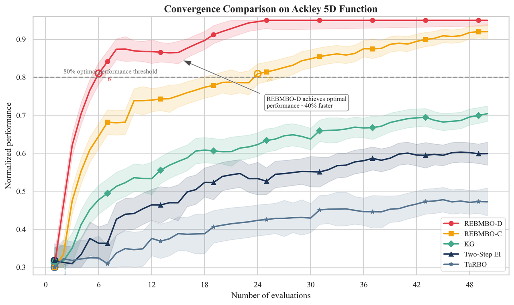
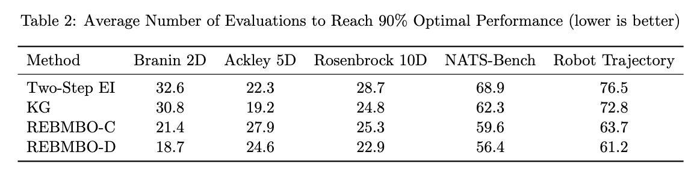

# Supplementary explanation for Reviewer_V6gH
## Figure 1: Convergence comparison on the Ackley 5D function

Figure 1: Convergence comparison on the Ackley 5D function, showing normalized performance across iterations. The shaded regions represent standard deviation over multiple runs. REBMBO-D reaches the 80% optimal performance threshold approximately 40% faster than other methods, demonstrating superior convergence speed and robustness.

## Table 1: Performance comparison between REBMBO and baseline methods

Table 1: Performance comparison between REBMBO and baseline methods (Two-Step EI, KG, TuRBO) across five benchmark optimization tasks under an equal computational budget. Results (mean ± standard deviation from 5 independent runs) indicate that REBMBO variants consistently achieve superior performance, demonstrating robustness and efficiency. Higher values represent better performance.

## Table 2: Comparison of different Bayesian optimization methods

Table 2: Comparison of different Bayesian optimization methods, reporting the average number of evaluations required to reach 90% of optimal performance across five benchmark tasks. REBMBO variants consistently achieve the target performance with fewer evaluations, highlighting their efficiency relative to baseline methods. Lower numbers indicate better performance.

## Table 3: Comparison of average best value quality

Table 3: Comparison of average best value quality (normalized performance, higher is better) across five benchmark optimization tasks. REBMBO variants consistently outperform baseline methods (Two-Step EI and KG), indicating their capability of identifying higher-quality solutions.

## Table 4: General computational complexity analysis

Table 4: Computational complexity analysis comparing traditional single-step Bayesian Optimization (BO) with the proposed REBMBO framework on a per-iteration basis. While both approaches share the same O(n³) complexity for Gaussian Process (GP) updates, REBMBO introduces additional computational requirements from Energy-Based Model (EBM) training using short-run MCMC (O(K·B·L·d·h)) and Reinforcement Learning strategy updates via Proximal Policy Optimization (O(M·Lπ·hπ)). Despite the increased complexity, REBMBO's superior optimization performance justifies these computational trade-offs, particularly for high-dimensional and complex objective functions where traditional BO methods struggle to converge efficiently.

## Table 5: Concrete Example of Per-Iteration

Table 5: Quantitative breakdown of computational operations required per iteration for each component of the REBMBO framework. The GP update involves approximately 64,000 operations (equivalent to O(n³) with n=40), which is CPU-based and occurs in every iteration. The EBM training with short-run MCMC is the most computationally intensive component at approximately 3.93 million operations, necessitating GPU acceleration for practical implementation with parallelizable MCMC steps. The PPO policy update adds minimal overhead with only about 1,280 operations per iteration and can also benefit from GPU acceleration. This concrete example illustrates the relative computational cost distribution across REBMBO's components.

## Table 6: Ablation Study on Branin2D and Nanophotonic3D

Table 6: Ablation study comparing optimization performance across different model configurations on two benchmark functions. Results report the mean final objective value and standard deviation after a fixed budget of iterations. For Branin (2D), higher values indicate better performance, with the complete REBMBO model achieving the best result (9.30 ± 0.12). For Nanophotonic (3D), lower (more negative) values represent superior performance, with the complete model again outperforming all partial configurations (-0.85 ± 0.04). Configurations A-D represent variants with different components removed, demonstrating that each component contributes to the overall performance of the full REBMBO approach.

## Table 7: Hyperparameters for Energy-Based Model

Table 7: Detailed specification of Energy-Based Model (EBM) hyperparameters used in the REBMBO framework, organized by component category. The EBM architecture employs a 7-dimensional input with 512 hidden units, 256 latent dimensions, and 2 residual blocks, targeting three objectives (T, R, A) with LeakyReLU activation. Training utilizes Adam optimizer with a 1e-4 learning rate, 30 epochs per step, and 64 batch size. The Energy-Based Upper Confidence Bound (UCB) strategy applies equal weighting (1.0) to all three objectives with an energy coefficient of 0.1. MCMC sampling configuration includes 20 steps per iteration from a uniform initial distribution, using a step size of 0.01 and temperature of 0.1. These parameter selections represent the optimized configuration for balancing model expressiveness with computational efficiency.

## ## Table 8: PPO Hyperparameters in REBMBO

Table 8: Comprehensive specification of the policy network architecture and Proximal Policy Optimization (PPO) hyperparameters utilized in the REBMBO framework. The policy network employs a 2-layer MLP with 256 neurons per layer and ReLU activations, taking Gaussian Process posterior and EBM signals as input state and outputting a Gaussian distribution over the parameter space. The PPO agent operates with a 3×10⁻⁴ learning rate, 0.99 discount factor, 0.2 clipping parameter, and runs for 4 epochs per update. Action sampling follows a normal distribution bounded within [-1.0, 1.0] (scaled to the parameter range). The reward function combines the objective function value with a negative EBM energy term to balance exploitation and exploration. The update mechanism uses advantage estimation with ratio clipping and Adam optimizer, implementing the standard PPO objective function to ensure stable policy improvements while preventing excessively large updates.

## Table 9: Parameter Sets in REBMBO

Table 9: Parameter Sets in REBMBO Framework - A comprehensive specification of parametric components within the Reward Energy-Based Multi-objective Bayesian Optimization architecture. The table delineates seven parameter classes (Θ, φ, θ, {α, ℓ}, β, γ, λ) with their respective functional components, optimization methodologies, and mathematical interpretations. Deep GP parameters (Θ) govern input space transformations via gradient-based likelihood optimization, while policy network parameters (φ) are updated through Proximal Policy Optimization. The energy function parameters (θ) utilize Short-run MCMC via Maximum Likelihood Estimation, with classic GP hyperparameters optimized through marginal likelihood methods. The framework incorporates fixed hyperparameters (γ, λ) that weight energy contributions in acquisition and reward functions, establishing a theoretically-grounded approach to exploration-exploitation trade-offs in complex multi-objective optimization landscapes.
