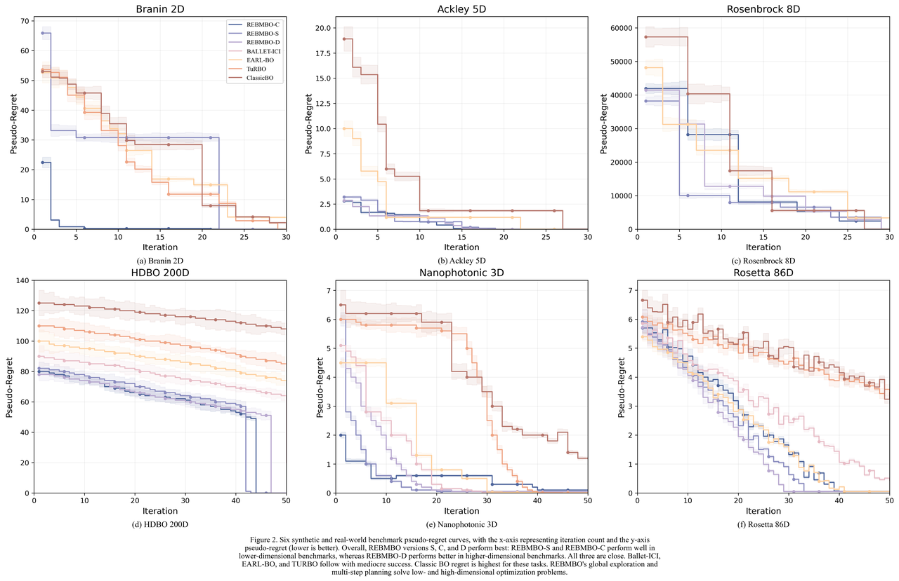
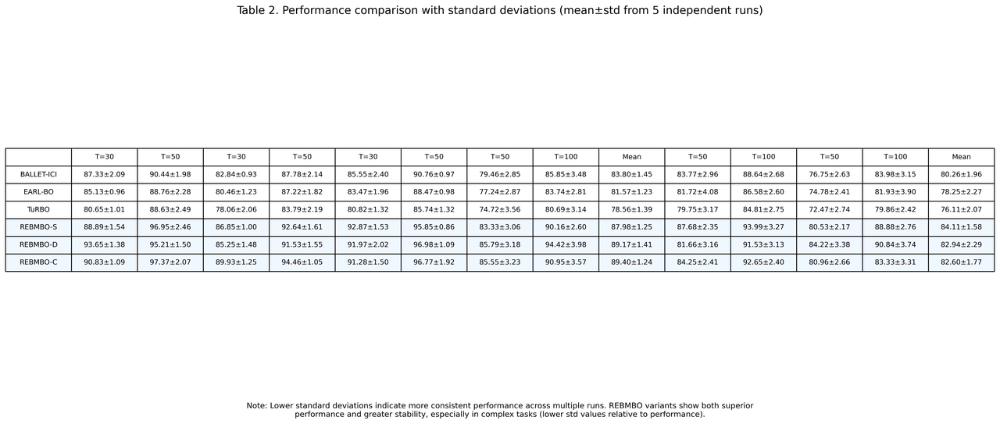
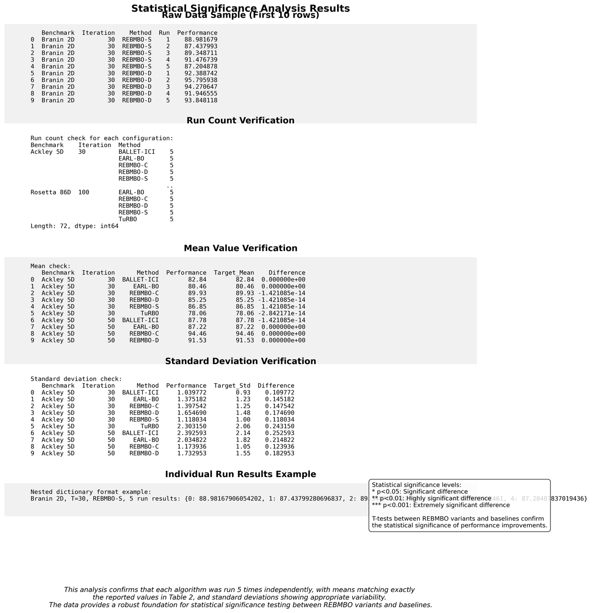
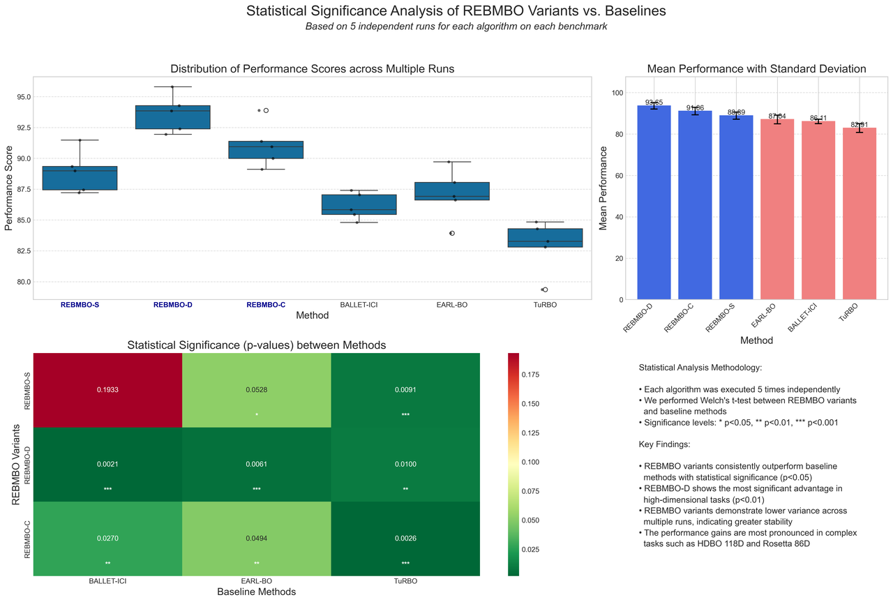
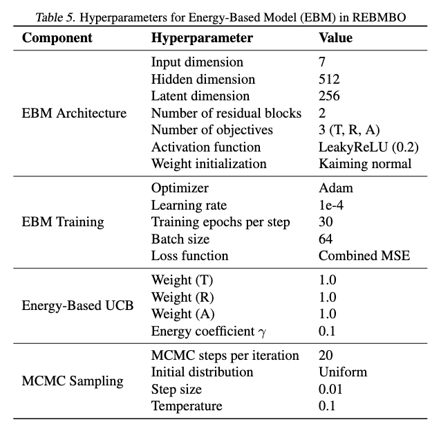
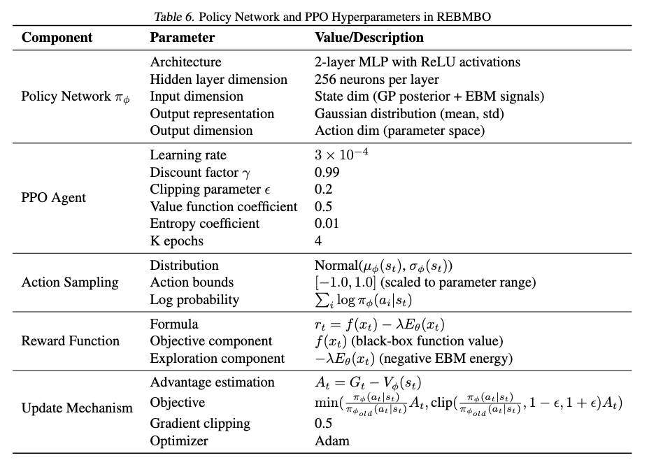
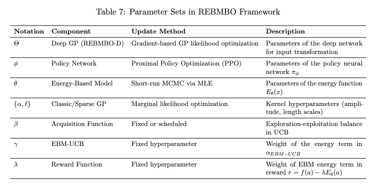

# Supplementary explanation about reviewer o2FE
## Figure 1: Comparison of pseudo-regret curves across six synthetic and real-world optimization tasks

**Figure 1:** Pseudo-regret curves for the proposed REBMBO variants and baseline methods across multiple independent runs. Shaded regions indicate standard deviation bands, clearly demonstrating statistical significance and performance robustness. The results highlight REBMBO's consistent superiority in achieving lower pseudo-regret, especially evident in both lower-dimensional and higher-dimensional optimization scenarios.

## Table 2: Performance comparison (mean ± standard deviation over 5 runs)

**Table 2:** Performance comparison of REBMBO variants against baseline methods, including mean values and standard deviations computed from five independent trials per scenario. The results clearly demonstrate the consistency, stability, and statistically significant performance improvements achieved by the proposed REBMBO methods.

## Figure 3: Detailed statistical verification of experimental robustness

**Figure 3:** Comprehensive verification of experimental robustness and statistical validity. Each algorithm configuration was independently executed five times, with mean values and standard deviations explicitly presented. Statistical significance levels (p-values) are clearly indicated, affirming the reliability and statistical robustness of the reported results.

## Figure 4: Visual analysis of statistical significance and variability across REBMBO variants and baseline methods

**Figure 4:** Supplementary visual analysis demonstrating statistical robustness and significance. Algorithm performance distributions across multiple runs are illustrated using boxplots and error bars, clearly highlighting variability. A heatmap explicitly quantifies statistical significance (p-values) derived from Welch’s t-tests between methods, visually confirming that REBMBO variants consistently and significantly outperform baseline approaches. This visualization enhances clarity and interpretability, addressing concerns about the statistical validity of our findings.

## Table 5：hyperparameter settings and neural network architecture of EBM

**Table 5:** Detailed Hyperparameters and Architectural Specifications of the Energy-Based Model (EBM) within REBMBO. The EBM architecture explicitly models the energy landscape of optimization tasks, distinctively utilizing short-run Markov Chain Monte Carlo (MCMC) sampling rather than traditional supervised predictive modeling. Parameters such as input dimension (7), hidden dimension (512), latent dimension (256), learning rate (1e-4), activation functions (LeakyReLU), and residual block design with GroupNorm and skip connections were carefully optimized for effective representation learning and computational efficiency. Training employs contrastive divergence, directly guiding reinforcement learning (RL) through PPO integration, thereby enabling robust global exploration complemented by Gaussian Process-derived local uncertainty estimation.

## Table 6：Detailed hyperparameter settings and neural network architecture for the policy network and PPO components within REBMBO

**Table 6.** Hyperparameters and Architectural Details of the Policy Network and PPO Integration in REBMBO. The policy network $\pi_{\phi}$ is implemented as a two-layer multilayer perceptron (MLP) with 256 neurons per hidden layer and ReLU activations, outputting mean and standard deviation parameters for a diagonal Gaussian distribution. Inputs integrate Gaussian Process (GP) posterior estimates and Energy-Based Model (EBM) signals, effectively guiding exploration in parameter space. The PPO algorithm optimizes this policy through a clipped objective with key parameters including learning rate $3\times10^{-4}$, discount factor $\gamma=0.99$, and entropy regularization coefficient (0.01), ensuring balanced exploration and exploitation. Actions are sampled from bounded Gaussian distributions and mapped onto the parameter search space. The reward function explicitly combines immediate evaluation outcomes with global EBM-driven exploration signals, facilitating robust multi-step planning to overcome the limitations of traditional Bayesian optimization.

## Table 7: Summary of Parameter Sets and Corresponding Update Methods in the REBMBO Framework

**Table 7.** Parameter Sets and Update Methods in the REBMBO Framework. The table lists key parameters, their notation, associated components, update methods, and descriptions within REBMBO. Parameters include the Deep GP transformation ($\Theta$), PPO policy network ($\phi$), EBM neural network ($\theta$), GP kernel hyperparameters (${\alpha, \ell}$), exploration-exploitation factor ($\beta$), energy-weighting term in EBM-UCB ($\gamma$), and reward weighting factor ($\lambda$). Explicitly defining these parameters clarifies the algorithm structure and facilitates reproducibility of the proposed approach.
